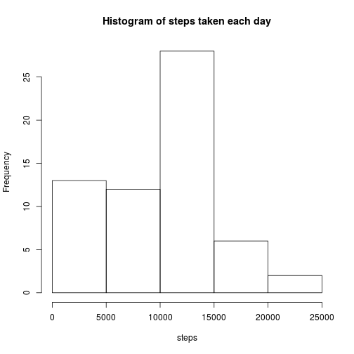
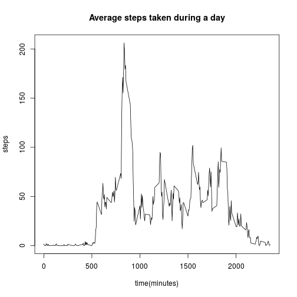
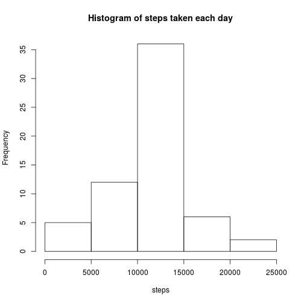
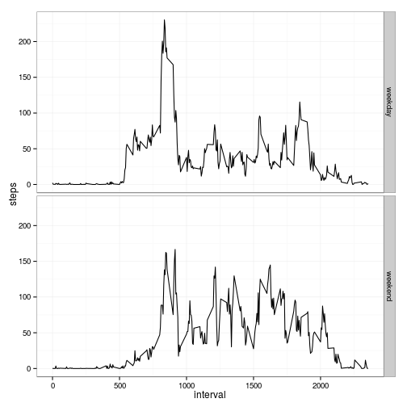

In this report I will use the 
[personal activity monitoring data](https://d396qusza40orc.cloudfront.net/repdata%2Fdata%2Factivity.zip) 
to answer several specific questions about the anonymous individual's daily activity.

## Loading and preprocessing the data
1. Load the data

```r
if(!file.exists("activity.csv")){ 
  unzip("activity.zip") # unzip the data file if it has not been unzipped.
}
activity <- read.csv("activity.csv")
```
2. Transform the data into a suitable format.

By looking at samples of the loaded data

```r
head(activity)
```

```
##   steps       date interval
## 1    NA 2012-10-01        0
## 2    NA 2012-10-01        5
## 3    NA 2012-10-01       10
## 4    NA 2012-10-01       15
## 5    NA 2012-10-01       20
## 6    NA 2012-10-01       25
```
We can see that it is probably better to convert the second column, which is the date, into the date format.

```r
activity[,"date"] = as.Date(activity[,"date"],format="%Y-%m-%d")
```
## What is mean total number of steps taken per day?
The missing values in the data set are ignored in this part.

1. Calculate the total number of steps taken per day

```r
step.day <- with(activity,aggregate(steps,by=list(date),FUN=sum,na.rm=T))
names(step.day) = c("date","steps")
head(step.day)
```

```
##         date steps
## 1 2012-10-01     0
## 2 2012-10-02   126
## 3 2012-10-03 11352
## 4 2012-10-04 12116
## 5 2012-10-05 13294
## 6 2012-10-06 15420
```

2. Make a histogram of the total number of steps taken each day

```r
with(step.day,hist(steps,main="Histogram of steps taken each day"))
```

 

3. Calculate the mean and median of the total number of steps taken per day

```r
mn = round(mean(step.day$steps,na.rm=T),2)
md = median(step.day$steps,na.rm=T)
```
The mean and median of the total number of steps taken per day are 9354.23 and 10395.

## What is the average daily activity pattern?

1. Make a time series plot (i.e. type = "l") of the 5-minute interval (x-axis) and the average number of steps taken, averaged across all days (y-axis)

```r
step.int <- with(activity,aggregate(steps,by=list(interval),FUN=mean,na.rm=T))
names(step.int) = c("interval","steps")
with(step.int,plot(interval,type="l",steps,main="Average steps taken during a day",xlab="time(minutes)"))
```

 

2. Which 5-minute interval, on average across all the days in the dataset, contains the maximum number of steps?

```r
max.interval = step.int[which.max(step.int$steps),1]
```
The maximum number of steps happen at the 5-minute interval starting at minute 835.

## Imputing missing values

1.Calculate and report the total number of missing values in the dataset (i.e. the total number of rows with NAs)

```r
num.na = sum(is.na(activity$steps))
```
The total number of missing values in the dataset is 2304

2.Devise a strategy for filling in all of the missing values in the dataset. The strategy does not need to be sophisticated. For example, you could use the mean/median for that day, or the mean for that 5-minute interval, etc.

The strategy is to fill the missing values with the mean steps for the corresponding 5-minute interval.
First, replicate the average daily step numbers to create a vector with the same order for date and interval as the original data set, while each value is filled with the average daily step numbers.
Then replace the NAs with the average steps cross all days at each time interval


3.Create a new dataset that is equal to the original dataset but with the missing data filled in.


```r
allstep.int = rep(step.int$steps,nrow(step.day))
filled.activity = activity
filled.activity$steps[is.na(activity$steps)] = allstep.int[is.na(activity$steps)]
```

4.Make a histogram of the total number of steps taken each day and Calculate and report the mean and median total number of steps taken per day. Do these values differ from the estimates from the first part of the assignment? What is the impact of imputing missing data on the estimates of the total daily number of steps?


```r
step2.day <- with(filled.activity,aggregate(steps,by=list(date),FUN=sum))
names(step2.day) = c("date","steps")
with(step2.day,hist(steps,main="Histogram of steps taken each day"))
```

 

```r
mn2 = round(mean(step2.day$steps),2)
md2 = median(step2.day$steps)
cat("mean=",mn2,", median=",md2)
```

```
## mean= 10766 , median= 10766
```

The histogram looks different than the one without imputation, especially at the first bin which contains 0-5000 steps. The mean and median steps also changed. The impact of imputation is an increase of the total daily number of steps, which manifests itself in both the histogram and the mean/median.

## Are there differences in activity patterns between weekdays and weekends?

For this part the weekdays() function may be of some help here. Use the dataset with the filled-in missing values for this part.

1.Create a new factor variable in the dataset with two levels – “weekday” and “weekend” indicating whether a given date is a weekday or weekend day.


```r
filled.activity[weekdays(filled.activity$date) %in% c("Saturday","Sunday"),4]="weekend"
filled.activity[!weekdays(filled.activity$date) %in% c("Saturday","Sunday"),4]="weekday"
filled.activity[,4]=as.factor(filled.activity[,4])
names(filled.activity)[4] = "daytype" 
```

2.Make a panel plot containing a time series plot (i.e. type = "l") of the 5-minute interval (x-axis) and the average number of steps taken, averaged across all weekday days or weekend days (y-axis). See the README file in the GitHub repository to see an example of what this plot should look like using simulated data.

First, calculate the mean step numbers with the data grouped according to the 5-minute intervals, and whether it is on weekday or weekend.

```r
step.int.daytype = with(filled.activity,aggregate(steps,by=list(interval,daytype),FUN=mean))
names(step.int.daytype)[1]="interval"
names(step.int.daytype)[2]="daytype"
names(step.int.daytype)[3]="steps"
```

Then, load in ggplot2 package, and plot the weekday and weekend step numbers in two panels.

```r
library(ggplot2)
stepplot = ggplot(step.int.daytype, aes(interval,steps))
stepplot+geom_line()+facet_grid(daytype ~ .)+theme_bw()
```

 
